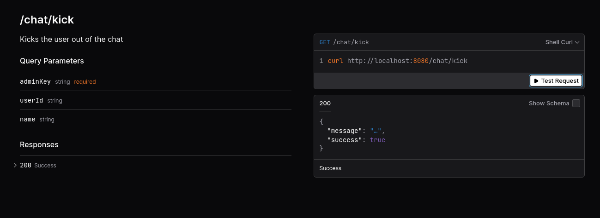

# sloppy-chat

This is a modern and performant chat server and client system, made for Slopify.dev.

Its super simple and designed to be as accessible for editing by community but still providing basic security features:
- No chat user name duplication
- Rate limiting and spam prevention 
- Server API for kicking users and banning IPs 

The server comes with the UI to trigger routes for basic admin operations like user removal and banning.

While there is nothing wrong with it, it was designed for fun so all users have `slop-` prefix names until authenticated via OAuth. This behaviour is controllable with evn variables.

It also supports bots creation by extending `!command` message format. 

# Admin authentication 

Server API that requires admin permissions simply requests user key (pass) as set by `CHAT_ADMIN_KEY` variable.
This is usually done in `.env` file.

# Client 

Client is TS but is auto transpiled to JS for funky HTML action.

```js

    const chatClient = new Client("ws://localhost:8080");
    chatClient.connect();

    //  Actions
    chatClient.send(message);
    chatClient.changeName(name);

    //  Callbacks
    chatClient.onConnected((name) => {
        console.log("CLIENT - got name", name);
        addMessage("Connected...", "system")
    });

    chatClient.onDisconnected(() => {
        console.log("CLIENT - close");
        addMessage("Disconnected.", "system")
    });

    chatClient.onMessage((from, text, type /* 1 - Bot | 0 - User */) => {
        console.log(`CLIENT message ${from}: ${text}`);
        addMessage(text, 'received', from);
    });
    
    chatClient.onNameChange((name, success) => {
        console.log(`CLIENT name change ${name}: ${success}`);
        addMessage(success ? `Name changed to ${name}` : `Name change failed`, 'system');
    });

```

# API

* Main route shows welcome with API link at http://localhost:8080/
* API Docs http://localhost:8080/docs (use this to kick users out)

Status route shows the count of connected users.



# Usage 

To install dependencies:

```bash
bun install
```

To run:

```bash
bun run server/server.ts
```

To generate JS client to use in HTML pages
```bash
 bun build ./client/client.ts --outfile  ./client/client.js
```